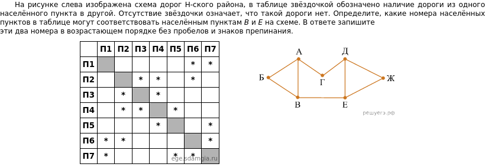
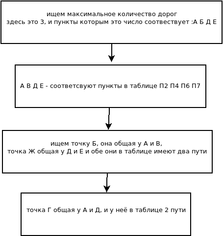

# info 2024
 ЕГЭ информатика 

>порог прохождения экзамена 44 балла
>>так как никто меня не готовит к эзамену тут я буду оставлять разработанные алгоритмы решения, надеюсь вам они тоже помогут, если да ставьте звёздочку репозиторию :)

ставлю перед собой [задачи](task.md)

свои успехи буду отмечать в [файле](report.md)

приложения к заданиям в [файле](addons.md)

# ---ОГЛАВЛЕНИЕ---

* [задание 1](https://github.com/T0kua/info-2024#%D0%B7%D0%B0%D0%B4%D0%B0%D0%BD%D0%B8%D0%B5-1)
* [задание 2](https://github.com/T0kua/info-2024#%D0%B7%D0%B0%D0%B4%D0%B0%D0%BD%D0%B8%D0%B5-2)
---

## задание 1

алгоритм :

### пояснение
> ищем варианты которые подходят под конкретный пункт, пробуем составить схему, пример размышления :
если А это - П4 то по таблице в пункт с тремя дорогами ведущей и в П4 подходит П2...
если выходит то продолжайте, не должно занимать больше 2-3 минут
> можно пробовать разные комбинации во втором шаге, подставляем под букву значение из соответсвующих

в результате должно получиться 

А - П4; Б - П3; В - П2; Г - П5; Д - П7; Е - П6; Ж - П1
> рекомендую рисовать в виде схемы

Ответ : число без запятых и пробелов (П не пишется) по условию, здесь 26

---------

## задание 2

см.приложение [задание 2](https://github.com/T0kua/info-2024/blob/main/addons.md#%D0%BF%D1%80%D0%B8%D0%BB%D0%BE%D0%B6%D0%B5%D0%BD%D0%B8%D0%B5-%D0%BA-%D0%B7%D0%B0%D0%B4%D0%B0%D0%BD%D0%B8%D1%8E-2)

> его я пока не научился делать